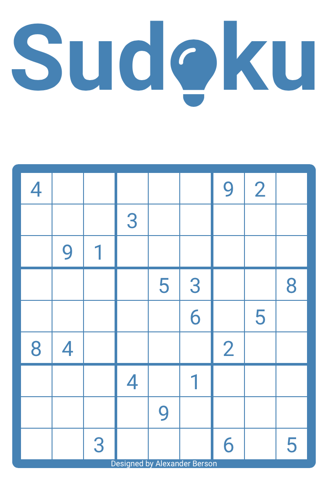

# Sudoku

Fill in the grid so that every digit appears only once in each row, column and region.  
You can [play Sudoku online](https://alex-berson.github.io/sudoku/) or  

You can also [watch an AI solving Sudoku](https://alex-berson.github.io/sudoku/index.html?mode=ai) (duration: approx. 6 mins).

## Description

**Sudoku** (/soo·’dow·koo, -’dok-, suh-/; Japanese: 数独 lit. "single digit") is a logic-based, combinatorial number-placement puzzle. In classic Sudoku, the objective is to fill a 9×9 grid with digits so that each column, each row, and each of the nine 3×3 subgrids that compose the grid (also called "boxes", "blocks", or "regions") contain all of the digits from 1 to 9.

## Screenshot

  

## License

Copyright &copy; 2023-2024 Alexander Berson. This project is licensed under the [MIT license](LICENSE.txt "MIT License").

